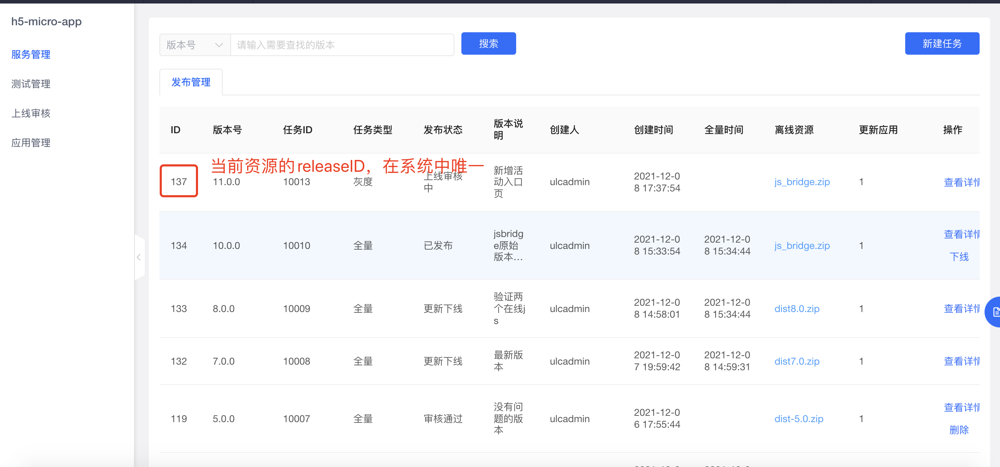
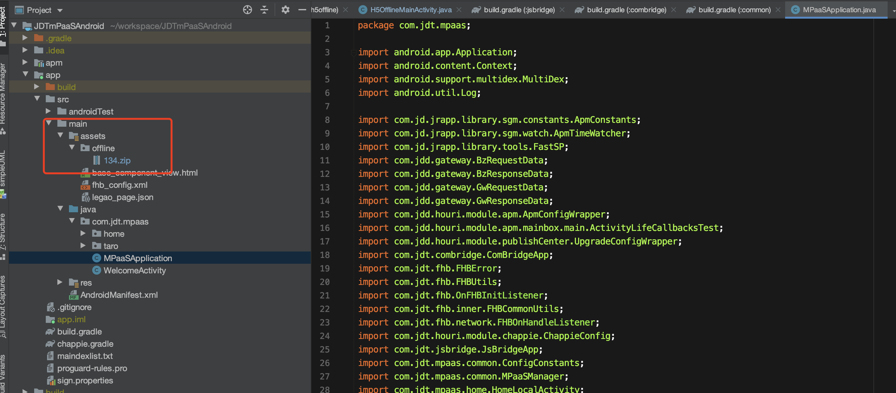

# 微应用-Android-接入文档


## 1. 系统环境
组件SDK支持Android 4.4 （api 19）及以上系统


## 2. 接入指南
1、在控制台创建应用，离线包需要通过App Code关联到某一个App上
2、在控制台创建对离线包服务，关联上面创建好的应用
3、将App Code设置到App离线包初始化代码里


## 3. 集成流程
#### 3.1 在AndroidManifest中添加权限

```xml
<uses-permission android:name="android.permission.INTERNET" />
<uses-permission android:name="android.permission.READ_EXTERNAL_STORAGE" />
<uses-permission android:name="android.permission.WRITE_EXTERNAL_STORAGE />

```


#### 3.2 引入SDK

1. 在工程build.gradle下添加nexus私服仓库地址

``` groovy
allprojects {
    repositories {
        maven { url "https://nexus.mpaas.jdcloud.com/repository/jdd-releases/" }
    }
}
```


2. 主module build.gradle中引入

```groovy
dependencies {
    implementation 'com.jdt.libs:h5offline:1.0.2'
    // 如果使用x5需引入
    implementation 'com.jdt.libs:x5:4.3.9.9.3'
}
```


#### 3.3 配置混淆
```proguard
# h5Offline
-keep class com.jd.jrapp.bm.offlineweb.** {*;}
-dontwarn com.jd.jrapp.bm.offlineweb.**

# webcontainer
-keep class com.jd.jrapp.bm.common.webcontainer.** {*;}
-dontwarn com.jd.jrapp.bm.common.webcontainer.**

# x5
-keep class com.tencent.smtt.** {*;}
-dontwarn com.tencent.smtt.**
-keep class com.tencent.tbs.** {*;}
-dontwarn com.tencent.tbs.** 

# JDDGateway
-keep class com.jdd.gateway.** {*;}
-dontwarn com.jdd.gateway.**

# JRNetwork
-keep class com.jd.jrapp.library.libnetwork.** {*;}
-dontwarn com.jd.jrapp.library.libnetwork.**
-keep class com.jd.jrapp.library.libnetworkbase.** {*;}
-dontwarn com.jd.jrapp.library.libnetworkbase.** 
-keep class com.jd.jrapp.library.libnetworkcore.okhttp.** {*;}
-dontwarn com.jd.jrapp.library.libnetworkcore.okhttp.**

# OkHttp3
-keep class com.squareup.okhttp3.** { *;}
-dontwarn com.squareup.okhttp3.**
-dontwarn okio.**
```


## 4. 代码接入

#### 4.1 初始化SDK的参数

```java
JROfflineConfigBuild build = new JROfflineConfigBuild(getApplicationContext())
    // 控制台申请的APPCode，表示当前应用的标识
    .setAppKey("your key")
    // 是否打开离线化加载
    .isOfflineSwitch(true)
    // 是否为调试状态
    .setDebug(true)
    // 请求离线包服务host地址
    .setHost("your host")
    // 设备标识
    .setDeviceId("your UUID")
    // 离线包不存在时是否需要等待下载
    .setOpenWaitLoading(true)
    // APP版本
    .setAppVersion("your version")
    // 网关ID，不对接网关的情况可以忽略
    .setAppId("your appid")
    // 用户ID
    .setPinId("userPin");
JROfflineManager.get(getApplicationContext()).init(build);
```


#### 4.2 调用离线包更新请求

```java
// 启动离线化 可根据需求在Application或者具体需要触发离线包下载更新时请求
JROfflineManager.get(this).startOfflineWeb(this);
```

#### 4.3 app中使用的WebView  继承JROfflineWebView

```java
public class JRWebView extends JROfflineWebView {

    public JRWebView(Context context, AttributeSet attributeSet) {
        super(context, attributeSet);
    }
}
```

> 当app使用x5继承JROfflineX5WebView


#### 4.4 使用自定义的WebView
布局中使用自定义WebView，代码中使用自定义WebView加载url

#### 4.5 设置WebViewClient
```java
webView.setWebViewClient(new JROfflineWebViewClient());
```

#### 4.6 特定URL开启关闭离线包
``` java
// 为false时，不会加载离线包
JROfflineManager.mOfflineSwitch = true;
```


## 5. 内置包

可以在应用打包的时候，将离线资源内置进App中，这样节省了从网络下载的环节，具体操作流程如下：

#### 5.1 上传生成离线资源

内置离线包功能使用，前提条件是需要在离线服务平台发布上线对应离线包，只有离线服务存在的离线包才会生效。所以需要按照离线化产品操作文档在控制台上传对应离线包之后，待将控制台生成加密之后离线资源下载内置进应用内。


#### 5.2 下载离线资源

在控制台上传发布离线资源之后，按照如下图所示下载离线资源


#### 5.3 更改离线包资源名称

将加密的离线资源下载之后，使用离线资源对应的releaseID作为唯一命名，保存至应用assets/offline/文件夹下




#### 5.4 内置离线资源



#### 5.5 使用

内置资源内置之后，即可正常使用内置离线包，在检测到需要对应资源时，如果本次已内置对应离线资源，则直接使用本地内置资源，不再从网络下载。相关处理已在离线化SDK底层处理完成。

#### 5.6 备注

1、内置离线资源需按照要求存放加密后资源，防止应用反编译资源信息泄露。

2、内置离线资源和离线平台服务关联通过releaseID关联（内置资源名称），内置资源命名需严格对应。


## 6.隐私政策合规

“本SDK没有涉及到隐私政策，暂可不增加”